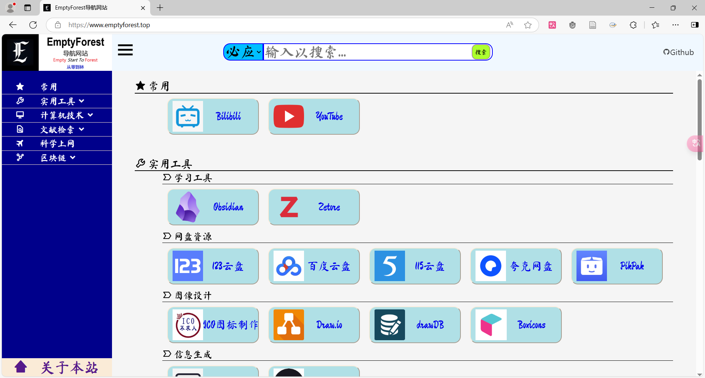
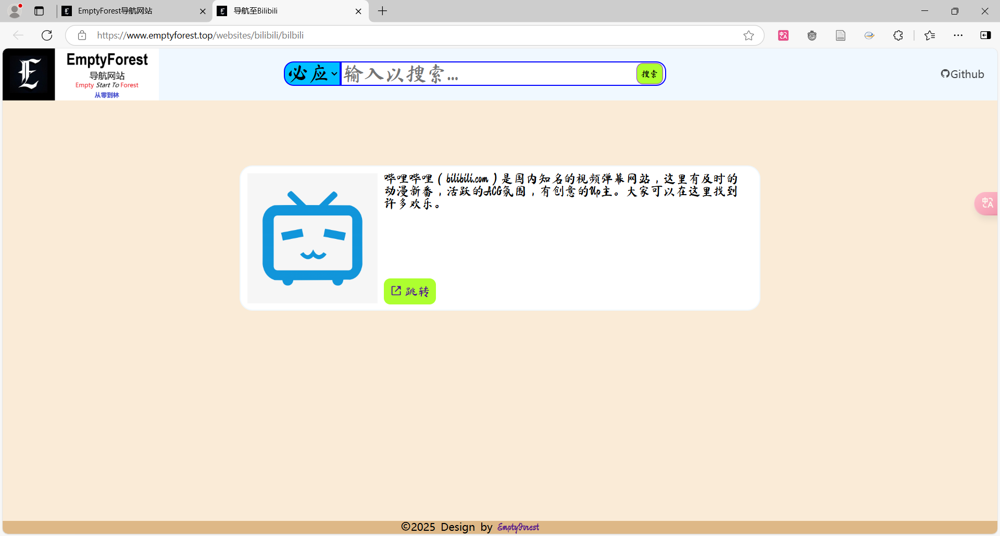

# EmptyStartToForest 写在开头
网址：<https://www.emptyforest.top>

本站搭建的初衷是为了学习前后端知识及框架，从0开始学习搭建一个静态导航网站，用以将平常用的多的网站和一些有价值的网站进行收藏，同时在其他地方可以打开自己的网站而免去收藏夹的使用

# 网站描述
导航站中每个链接都有自己单独的链接而不直接跳转到网站，以供描述与备注网站内容，对我来说若后续网站太多通过该方式反而能够找到需要的东西

# 展望
后续不仅在添加网站的同时也逐步学习从而优化一下设计，通过作为学习的一个小项目，为后期在web端的学习打下基础。