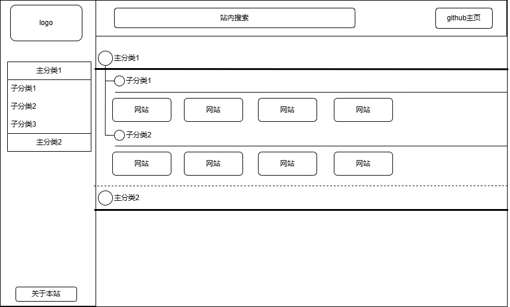
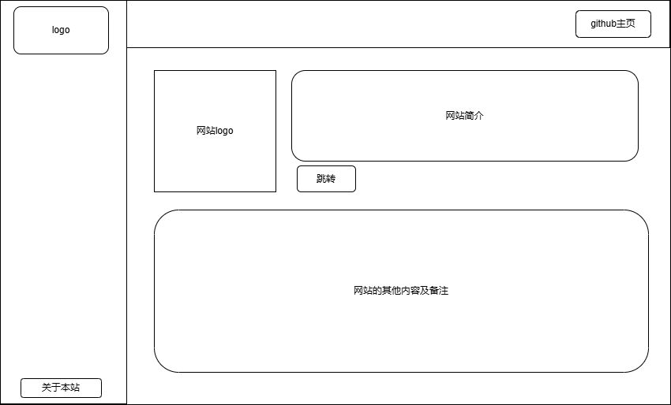

# EmptyStartToForest 写在开头
从Empty（0）开始到Forest（森林），从零开始写网站到最终成为广阔的森林，在一望无际的大地上一颗颗植树，直到变为巨大的森林
从0开始学习搭建一个静态导航网站，用以将平常用的多的网站和一些有价值的网站进行收藏，同时在其他地方可以打开自己的网站而免去收藏夹的使用

# 具体思路
## 使用HTML+CSS+Javascript作为技术栈
## 大致布局
index.html的布局基本如下：

每当打开一个网站时，先进入一个介绍网站再由用户决定跳不跳转，介绍网站的布局如下：

